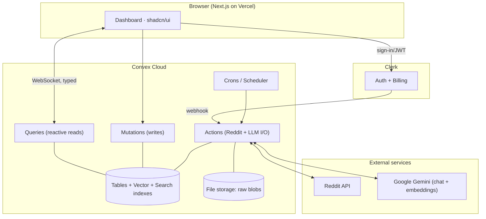
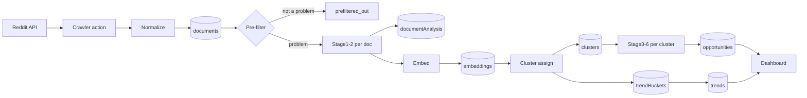
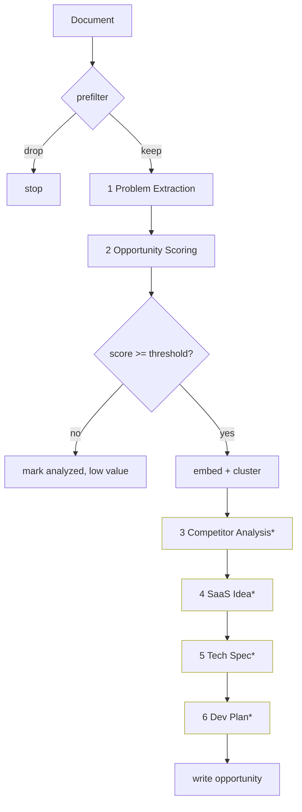
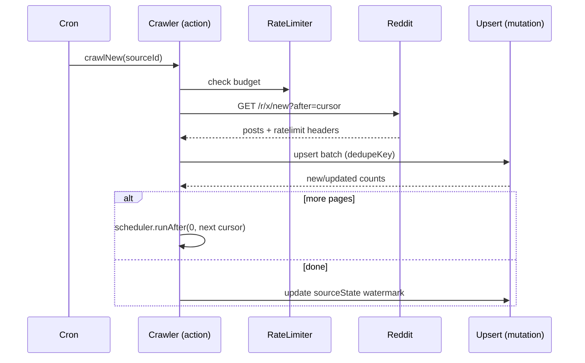
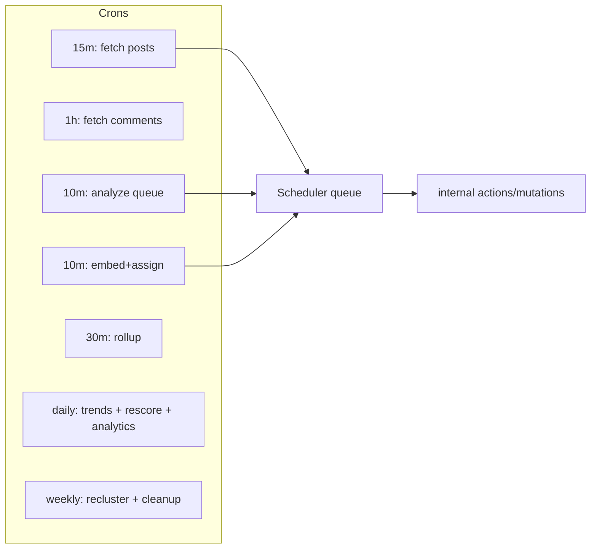
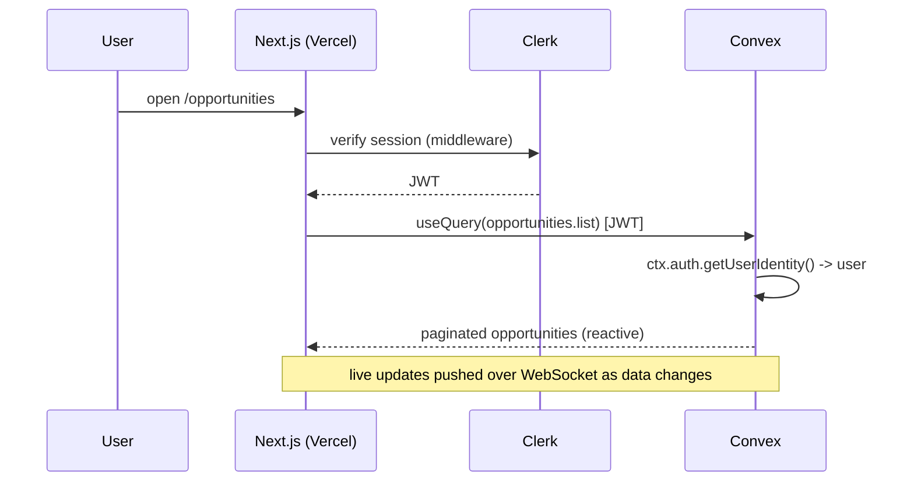

# Reddit SaaS Opportunity Intelligence Platform — Architecture & Implementation Blueprint

> **Status:** Design document. No application code yet. This is the canonical blueprint that subsequent build sessions follow.
> **Stack:** Next.js (App Router) · TypeScript · TailwindCSS · shadcn/ui · Clerk · Convex · LangChain · Google Gemini · Vercel + Convex Cloud
> **Existing foundation:** The repo is already a Convex + Clerk + Next.js starter. Clerk auth is wired (`convex/auth.config.ts`, Clerk webhook in `convex/http.ts`, `users` table keyed by `externalId` = Clerk subject). Clerk Billing exists via `paymentAttempts`. We extend this, we do not replace it.

---

## Table of Contents

1. [High-Level System Overview](#1-high-level-system-overview)
2. [Detailed Module Breakdown](#2-detailed-module-breakdown)
3. [Convex Database Schema](#3-convex-database-schema)
4. [Folder Structure](#4-folder-structure)
5. [API Design](#5-api-design)
6. [AI Pipeline Design](#6-ai-pipeline-design)
7. [Clustering System](#7-clustering-system)
8. [Trending Engine](#8-trending-engine)
9. [Search](#9-search)
10. [Dashboard & Pages](#10-dashboard--pages)
11. [Background Jobs (Cron)](#11-background-jobs-cron)
12. [Architecture Diagrams](#12-architecture-diagrams)
13. [Security](#13-security)
14. [Scalability Strategy](#14-scalability-strategy)
15. [Future Data Sources](#15-future-data-sources)
16. [Development Roadmap](#16-development-roadmap)

---

## 1. High-Level System Overview

### 1.1 What the system does

A continuously-running intelligence pipeline that:

1. **Ingests** posts and comments from a configurable list of subreddits on a schedule.
2. **Normalizes** Reddit content into a source-agnostic internal representation.
3. **Analyzes** each item through a multi-stage LangChain + Gemini pipeline (problem extraction → scoring → competitor analysis → SaaS idea → tech spec → build plan).
4. **Embeds** problems into vectors and **clusters** semantically-similar problems together.
5. **Aggregates** clusters into ranked, deduplicated **SaaS Opportunities** with full generated business + technical specs.
6. **Detects trends** over time (mention velocity, growth).
7. **Serves** a searchable, browsable dashboard to authenticated users.

### 1.2 Core design principles

| Principle | Consequence |
|---|---|
| **Source-agnostic core** | Reddit is the first `source`, not the only one. All ingestion writes to a generic `documents` model. Adding Hacker News later = new adapter, zero schema migration of the AI layer. |
| **Convex as the system of record + orchestrator** | Crons, queues, durable workflow state, reactive reads all live in Convex. No external queue/worker infra for v1. |
| **Idempotent, incremental, resumable** | Every external item has a stable dedupe key. Re-running any stage is safe. Long jobs self-reschedule to respect Convex transaction limits. |
| **Pipeline as a state machine, not a god-prompt** | Each AI stage is a discrete, cached, independently retriable unit with its own validator. A failure in Stage 4 never re-runs Stages 1–3. |
| **Cost is a first-class budget** | Cheap deterministic filters run *before* any LLM call. Embeddings and cheap models gate expensive generation. Per-day token ceilings enforced. |
| **Denormalize for read, normalize for truth** | Raw Reddit data normalized; dashboard-facing aggregates denormalized onto opportunity/cluster docs for fast reactive reads. |

### 1.3 The three planes

```
INGESTION PLANE        →   ANALYSIS PLANE          →   SERVING PLANE
(Reddit adapter,           (LangChain chains,           (Next.js dashboard,
 crawler, raw store)        embeddings, clustering,      Convex reactive queries,
                            trending, scoring)           search, Clerk auth)
```

Each plane is decoupled by Convex tables + a processing-status field, so they run at independent cadences and scale independently.

---

## 2. Detailed Module Breakdown

### 2.1 Reddit Integration (`convex/reddit/`)

> **Implementation note (updated):** Reddit ingestion is implemented via the **Apify actor `trudax/reddit-scraper-lite`** (called over Apify's REST `run-sync-get-dataset-items` endpoint with an `APIFY_TOKEN`), **not** the Reddit OAuth API. This removes the OAuth/token, custom rate-limiter, and cursor-pagination concerns below (Apify handles auth, proxies, and rate limits). Incremental crawling uses the actor's `postDateLimit` driven by our stored watermark. Apify returns posts **and** their comments in one run, so the separate comment-sync cron was collapsed into a single 15-min crawl. The source-agnostic design is unchanged — Apify is just the transport for the Reddit adapter. The table below documents the original direct-API design for reference.

The lowest layer — a typed, resilient client around the source's API.

| Concern | Design |
|---|---|
| **OAuth** | Reddit "script" or "web app" OAuth2 **client-credentials / application-only** flow (read-only, no per-user Reddit auth needed). Token fetched in a Convex **action** (Node runtime), cached in a `sourceTokens` table with expiry; refreshed lazily when <60s of life remains. |
| **API wrapper** | A thin typed wrapper exposing `getNew(subreddit, { after, limit })`, `getComments(postId)`, `getSubredditAbout(subreddit)`. Returns normalized DTOs, never raw fetch responses leak upward. |
| **Rate limiting** | Reddit allows ~100 req/min for OAuth (600 per 10 min). A `rateLimiter` reads the `X-Ratelimit-Remaining` / `X-Ratelimit-Reset` headers, persists them in `sourceState`, and the scheduler throttles accordingly. Use the [`@convex-dev/rate-limiter`](https://www.convex.dev/components/rate-limiter) component for a token-bucket gate. |
| **Retry logic** | Exponential backoff with jitter on 429/5xx; max 5 attempts. 4xx (except 429) = permanent failure, logged and skipped. Wrapped so a single bad post never kills a batch. |
| **Cursor pagination** | Reddit uses opaque `after`/`before` fullnames (`t3_xxx`). Per (source, subreddit) we persist the last-seen cursor + last-seen `created_utc` watermark in `sourceState`. |
| **Incremental syncing** | Each crawl fetches `/new` since the stored watermark, stopping when it reaches already-seen IDs. Comments fetched only for posts flagged "needs comment sync". |
| **Scheduled jobs** | Driven by Convex crons (see §11). Crons enqueue per-subreddit jobs rather than doing work inline. |
| **Error handling** | Three tiers: (1) transient → retry; (2) item-level → mark item `errored`, continue batch; (3) source-level (auth dead, subreddit banned) → mark `sourceState.status = "degraded"`, alert, stop that subreddit only. |

> Reddit calls **must** happen inside Convex **actions** (`"use node";` only if a Node built-in is needed — `fetch` works in the default runtime). Actions cannot touch `ctx.db`; they call internal mutations to persist results.

### 2.2 Reddit Crawler (`convex/sources/reddit/crawler.ts`)

Orchestrates fetch → normalize → persist.

- **Fetch newest posts** per subreddit using the watermark.
- **Fetch comments** for posts that are new or recently active (separate, cheaper cadence).
- **Detect edited posts** via `edited` timestamp + content hash; if `contentHash` changed, mark the document `reprocess = true` so the AI layer re-analyzes.
- **Ignore duplicates** via `dedupeKey = "reddit:" + fullname`; upsert by unique index.
- **Update scores** — score/upvote-ratio/num_comments are volatile; refresh them on re-crawl without re-running AI (they feed ranking, not extraction).
- **Store raw payload** — the untouched JSON is kept (compressed / in `rawDocuments` or file storage) for reprocessing and audit, separate from the normalized `documents` row.

**Batching for transaction limits:** crawler actions fetch from Reddit, then hand batches (≤ ~100 items) to an `internalMutation` that upserts. If a subreddit has a huge backlog, the action self-reschedules via `ctx.scheduler.runAfter(0, ...)` with the next cursor.

### 2.3 Ingestion Normalizer (`convex/ingest/`)

Converts any source's DTO into the generic `documents` shape. This is the seam that makes future sources cheap:

```
RedditPost ─┐
RedditComment ─┤→  normalize()  →  Document { source, sourceType, externalId,
HNStory ─┤                              title, body, author, score, url,
GitHubIssue ─┘                          createdAt, subredditOrChannel, dedupeKey,
                                        contentHash, status: "pending_analysis" }
```

### 2.4 AI Pipeline (`langchain/` + `convex/ai/`)

See §6. Six chains, each a discrete Convex action stage, orchestrated by a workflow runner that tracks per-document stage status. Uses Gemini for generation and `text-embedding-004` for embeddings.

### 2.5 Clustering Engine (`convex/clustering/`)

See §7. Embeddings + Convex vector search → incremental online clustering → periodic full re-cluster → cluster→opportunity rollup.

### 2.6 Opportunity Builder (`convex/opportunities/`)

Aggregates a cluster's analyzed documents into a single canonical `opportunities` row: merges problem statements, picks the best generated SaaS idea (or generates one at cluster level), rolls up scores (median/weighted), and denormalizes display fields.

### 2.7 Trending Engine (`convex/trending/`)

See §8. Time-bucketed mention counts per cluster/industry → velocity + growth → `trends` table feeding graphs.

### 2.8 Search Service (`convex/search/`)

See §9. Hybrid: Convex full-text search index for keywords + vector search for semantic + indexed filters for facets.

### 2.9 Auth & Billing (existing, extended)

Clerk already wired. We add: `role` on `users` (`user` | `admin`), bookmarks, saved searches, and gate premium features through existing Clerk Billing (`paymentAttempts`).

### 2.10 Admin & Observability (`convex/admin/`)

Source config CRUD, pipeline dashboards, cost/usage metrics, manual reprocess triggers, dead-letter inspection.

---

## 3. Convex Database Schema

All tables in `convex/schema.ts`. Notation below is the design intent; validators use `convex/values`. **Existing tables (`users`, `paymentAttempts`) are kept**; `users` is extended with `role` and `preferences`.

### 3.1 Identity & Billing (existing + extended)

#### `users` *(extend existing)*
| Field | Validator | Notes |
|---|---|---|
| `name` | `v.string()` | existing |
| `externalId` | `v.string()` | existing — Clerk `subject` (JWT). Auth lookups use `identity.subject` → this. |
| `role` | `v.union(v.literal("user"), v.literal("admin"))` | **new**, default `"user"` |
| `preferences` | `v.optional(v.object({...}))` | **new** — UI prefs, default industries |
| Indexes | `byExternalId: ["externalId"]` | existing |

#### `paymentAttempts` *(existing, unchanged)* — Clerk Billing.

### 3.2 Source Configuration & State

#### `sources`
The registry of data sources and their config. One row per (source, channel) e.g. `("reddit", "r/SaaS")`.
| Field | Validator | Notes |
|---|---|---|
| `source` | `v.union(v.literal("reddit"), v.literal("hackernews"), ...)` | extensible union |
| `channel` | `v.string()` | subreddit name / HN tag / etc. |
| `displayName` | `v.string()` | |
| `enabled` | `v.boolean()` | toggle crawling without deleting |
| `crawlIntervalMinutes` | `v.number()` | per-source cadence override |
| `priority` | `v.number()` | scheduler ordering / budget weighting |
| `config` | `v.object({...})` | source-specific (e.g. min score, flair filters) |
| Indexes | `by_source_and_channel: ["source","channel"]`, `by_enabled: ["enabled"]` | |

#### `sourceState`
Mutable crawl bookkeeping, **separated from `sources`** (high-churn vs stable config, per guidelines).
| Field | Validator | Notes |
|---|---|---|
| `sourceId` | `v.id("sources")` | FK |
| `lastCursor` | `v.optional(v.string())` | Reddit `after` fullname |
| `lastWatermark` | `v.optional(v.number())` | max `created_utc` seen |
| `lastCrawlAt` | `v.optional(v.number())` | |
| `status` | `v.union(v.literal("ok"), v.literal("degraded"), v.literal("disabled"))` | |
| `rateRemaining` / `rateResetAt` | `v.optional(v.number())` | from Reddit headers |
| `consecutiveErrors` | `v.number()` | circuit-breaker counter |
| Indexes | `by_sourceId: ["sourceId"]` | |

#### `sourceTokens`
OAuth tokens (application-only). Never exposed to client functions.
| Field | Validator | Notes |
|---|---|---|
| `source` | `v.string()` | |
| `accessToken` | `v.string()` | |
| `expiresAt` | `v.number()` | |
| Indexes | `by_source: ["source"]` | |

> Secrets (client id/secret) live in Convex environment variables, **not** in tables.

### 3.3 Raw & Normalized Content

#### `documents`  — the source-agnostic core
| Field | Validator | Notes |
|---|---|---|
| `source` | `v.string()` | "reddit" |
| `sourceType` | `v.union(v.literal("post"), v.literal("comment"))` | |
| `externalId` | `v.string()` | Reddit fullname `t3_/t1_` |
| `dedupeKey` | `v.string()` | `"reddit:" + externalId`, **unique** |
| `parentExternalId` | `v.optional(v.string())` | comment → post |
| `sourceId` | `v.id("sources")` | which channel |
| `channel` | `v.string()` | denormalized subreddit (read speed) |
| `title` | `v.optional(v.string())` | posts only |
| `body` | `v.string()` | |
| `author` | `v.optional(v.string())` | nullable (deleted) |
| `url` | `v.optional(v.string())` | |
| `score` | `v.number()` | upvotes (volatile) |
| `upvoteRatio` | `v.optional(v.number())` | |
| `numComments` | `v.optional(v.number())` | |
| `createdAt` | `v.number()` | source `created_utc` (ms) |
| `editedAt` | `v.optional(v.number())` | |
| `contentHash` | `v.string()` | for edit detection |
| `rawRef` | `v.optional(v.id("_storage"))` | raw JSON blob (optional) |
| `analysisStatus` | `v.union("pending","prefiltered_out","analyzing","analyzed","errored")` | pipeline state |
| `isProblem` | `v.optional(v.boolean())` | cheap prefilter result |
| `clusterId` | `v.optional(v.id("clusters"))` | denormalized for fast joins |
| `language` | `v.optional(v.string())` | non-English skipped or translated |
| Indexes | `by_dedupeKey: ["dedupeKey"]` (unique upsert) · `by_status: ["analysisStatus"]` · `by_source_channel_createdAt: ["source","channel","createdAt"]` · `by_cluster: ["clusterId"]` · `by_parent: ["parentExternalId"]` | |
| Search index | `search_body` on `body`, filterFields `["channel","source","analysisStatus"]` | full-text |

> **Why a single `documents` table for posts and comments?** Both are "a piece of text that may contain a problem." Discriminated by `sourceType`. Keeps the AI layer uniform.

#### `documentAnalysis` — Stage 1–6 results (one row per analyzed document)
Kept **separate** from `documents` because: (a) it's large, (b) it's written by a different plane, (c) it lets us reprocess/version analysis without rewriting the volatile document.
| Field | Validator | Notes |
|---|---|---|
| `documentId` | `v.id("documents")` | FK, unique |
| `pipelineVersion` | `v.string()` | prompt/chain version for cache invalidation |
| **Stage 1 — Problem Extraction** | `v.object({ problemStatement, who, industry, severity (1-5), urgency (1-5), recurring (bool), workaround, desiredSolution })` | |
| **Stage 2 — Opportunity Scoring** | `v.object({ opportunityScore (0-100), willingnessToPay, marketSizeEstimate, frequency, viability, complexity })` | |
| **Stage 3 — Competitor Analysis** | `v.object({ existingProducts: array, saturated (bool), underserved (bool), gaps: array })` | |
| **Stage 4 — SaaS Idea** | `v.object({ name, summary, icp, pricingIdeas, mvpScope, roadmap, monetization, advantage })` | |
| **Stage 5 — Tech Spec** | `v.object({ features, roles, pages, navigation, apiEndpoints, dbSchema, jobs, auth, integrations, architecture, libraries })` | |
| **Stage 6 — Dev Plan** | `v.object({ milestones, phases, estimatedBuildTime, difficulty })` | |
| `embeddingId` | `v.optional(v.id("embeddings"))` | |
| `confidence` | `v.number()` | aggregate AI confidence 0-1 |
| `stageStatus` | `v.object({ s1..s6: "pending|done|error" })` | resumable workflow |
| `tokenUsage` | `v.object({ prompt, completion, embedding })` | cost tracking |
| Indexes | `by_documentId: ["documentId"]` · `by_industry: ["stage1.industry"]` (if flattened) · `by_opportunityScore` | |

> Large stage objects could individually approach document limits only in pathological cases; arrays inside (features, roadmap) are bounded by prompt design. If they grow unbounded, promote to child tables. For v1 they stay embedded.

### 3.4 Embeddings & Clustering

#### `embeddings`
| Field | Validator | Notes |
|---|---|---|
| `documentId` | `v.id("documents")` | |
| `vector` | `v.array(v.float64())` | 768-dim (Gemini `text-embedding-004`) |
| `model` | `v.string()` | for re-embed migrations |
| `industry` | `v.optional(v.string())` | filterField for scoped vector search |
| Vector index | `by_vector: { vectorField: "vector", dimensions: 768, filterFields: ["industry","source"] }` | |
| Indexes | `by_documentId: ["documentId"]` | |

> Convex vector search runs **only inside actions** via `ctx.vectorSearch("embeddings","by_vector",{ vector, limit, filter })`, returns `_id`+`_score`. Results are then loaded via a query.

#### `clusters`
| Field | Validator | Notes |
|---|---|---|
| `title` | `v.string()` | canonical problem label (AI-generated) |
| `summary` | `v.string()` | merged problem summary |
| `industry` | `v.optional(v.string())` | dominant industry |
| `centroid` | `v.array(v.float64())` | mean vector (recomputed on membership change) |
| `memberCount` | `v.number()` | **denormalized counter** (never count rows) |
| `documentIds` | — | **NOT stored as array** (unbounded). Membership lives on `documents.clusterId` + `clusterMembers`. |
| `confidence` | `v.number()` | cohesion score (avg intra-cluster similarity) |
| `opportunityId` | `v.optional(v.id("opportunities"))` | rollup target |
| `firstSeenAt` / `lastSeenAt` | `v.number()` | for trending |
| `status` | `v.union("active","merged","archived")` | |
| `mergedInto` | `v.optional(v.id("clusters"))` | when two clusters merge |
| Indexes | `by_industry: ["industry"]` · `by_status: ["status"]` · `by_memberCount: ["memberCount"]` · `by_lastSeen: ["lastSeenAt"]` | |
| Vector index | `by_centroid` on `centroid` (find nearest cluster for a new doc) | |

#### `clusterMembers` (join table — avoids unbounded array on cluster)
| Field | Validator | Notes |
|---|---|---|
| `clusterId` | `v.id("clusters")` | |
| `documentId` | `v.id("documents")` | |
| `similarity` | `v.number()` | doc↔centroid at assignment |
| Indexes | `by_cluster: ["clusterId"]` · `by_document: ["documentId"]` · `by_cluster_and_similarity: ["clusterId","similarity"]` | |

### 3.5 Opportunities (the product)

#### `opportunities`
The denormalized, dashboard-facing entity. One per significant cluster.
| Field | Validator | Notes |
|---|---|---|
| `clusterId` | `v.id("clusters")` | source cluster |
| `title` | `v.string()` | |
| `slug` | `v.string()` | unique, for URLs |
| `problemSummary` | `v.string()` | |
| `painPoints` | `v.array(v.string())` | bounded |
| `aiSummary` | `v.string()` | |
| `saas` | `v.object({ name, summary, icp, features, pricing, monetization, advantage })` | best/merged Stage 4 |
| `techSpec` | `v.object({...})` | Stage 5 rollup |
| `buildPlan` | `v.object({...})` | Stage 6 rollup |
| `scores` | `v.object({ opportunity, willingnessToPay, marketSize, viability, complexity, confidence })` | rolled-up (weighted median) |
| `competition` | `v.object({ saturated, underserved, gaps })` | |
| `industry` | `v.string()` | facet |
| `mentionCount` | `v.number()` | denormalized = cluster.memberCount |
| `topDocumentIds` | `v.array(v.id("documents"))` | **bounded** (top N for display) |
| `trendDirection` | `v.union("rising","steady","declining","new")` | from trending engine |
| `firstSeenAt` / `lastUpdatedAt` | `v.number()` | |
| Indexes | `by_slug: ["slug"]` · `by_industry_and_score: ["industry","scores.opportunity"]` · `by_score: ["scores.opportunity"]` · `by_trend: ["trendDirection"]` · `by_cluster: ["clusterId"]` | |
| Search index | `search_opportunities` on `title`/`aiSummary`, filterFields `["industry","trendDirection"]` | |

> Full member list is **not** on the opportunity (unbounded). The detail page paginates `clusterMembers` → `documents`. `topDocumentIds` is a small bounded cache for the hero section.

### 3.6 Trending

#### `trendBuckets`
Time-series counts. One row per (entity, granularity, bucketStart).
| Field | Validator | Notes |
|---|---|---|
| `entityType` | `v.union("cluster","industry","opportunity")` | |
| `entityId` | `v.string()` | id or industry name |
| `granularity` | `v.union("day","week","month")` | |
| `bucketStart` | `v.number()` | epoch of bucket start |
| `count` | `v.number()` | mentions in bucket |
| Indexes | `by_entity_gran_bucket: ["entityType","entityId","granularity","bucketStart"]` | range scan for graphs |

#### `trends` (computed snapshot for fast reads)
| Field | Validator | Notes |
|---|---|---|
| `entityType` / `entityId` | | |
| `velocity` | `v.number()` | mentions/period |
| `growthRate` | `v.number()` | period-over-period % |
| `direction` | `v.union("rising","steady","declining","new")` | |
| `series` | `v.array(v.object({ t, count }))` | **bounded** (last N buckets) for sparkline |
| `computedAt` | `v.number()` | |
| Indexes | `by_entity: ["entityType","entityId"]` · `by_growth: ["growthRate"]` | |

### 3.7 User-facing data

#### `bookmarks`
| Field | Validator | Notes |
|---|---|---|
| `userId` | `v.id("users")` | derived server-side from auth, never from args |
| `opportunityId` | `v.id("opportunities")` | |
| Indexes | `by_user: ["userId"]` · `by_user_and_opportunity: ["userId","opportunityId"]` | |

#### `savedSearches`
| Field | Validator | Notes |
|---|---|---|
| `userId` | `v.id("users")` | |
| `name` | `v.string()` | |
| `query` | `v.object({...})` | serialized filter state |
| Indexes | `by_user: ["userId"]` | |

### 3.8 Operations

#### `pipelineRuns` (audit / dead-letter / cost)
| Field | Validator | Notes |
|---|---|---|
| `kind` | `v.union("crawl","analyze","embed","cluster","trend")` | |
| `targetId` | `v.optional(v.string())` | documentId/sourceId |
| `status` | `v.union("running","success","error","retrying")` | |
| `error` | `v.optional(v.string())` | |
| `attempt` | `v.number()` | |
| `tokenUsage` / `costEstimate` | `v.optional(...)` | |
| `startedAt` / `finishedAt` | `v.number()` | |
| Indexes | `by_kind_and_status: ["kind","status"]` · `by_startedAt: ["startedAt"]` | |

#### `usageDaily` (cost guardrails)
| Field | Validator | Notes |
|---|---|---|
| `date` | `v.string()` | "YYYY-MM-DD" |
| `llmTokens` / `embeddingTokens` / `estCostUsd` / `documentsAnalyzed` | `v.number()` | |
| Indexes | `by_date: ["date"]` | daily budget enforcement |

### 3.9 Normalization vs Denormalization summary

| Data | Strategy | Why |
|---|---|---|
| Raw Reddit JSON | Normalized + raw blob kept | reprocessing/audit |
| Document ↔ analysis | Split into two tables | different write planes, large payload, versioning |
| Cluster membership | Join table + `clusterId` on doc + denormalized `memberCount` | unbounded list → never an array field |
| Opportunity display fields | Denormalized (scores, mentionCount, topDocs, trend) | fast reactive reads, no fan-out joins on hot path |
| Counts | Denormalized counters, incremented in mutations | Convex has no count operator |
| Trends | Pre-computed `trends` snapshot + raw `trendBuckets` | graph reads must be O(1) |

---

## 4. Folder Structure

```
reddit-saas/
├─ app/                              # Next.js App Router
│  ├─ (marketing)/                   # public landing, pricing
│  ├─ (dashboard)/
│  │  ├─ layout.tsx                  # Clerk-gated shell, nav
│  │  ├─ page.tsx                    # Dashboard home
│  │  ├─ opportunities/
│  │  │  ├─ page.tsx                 # list + filters
│  │  │  └─ [slug]/page.tsx          # Opportunity Detail
│  │  ├─ trending/page.tsx
│  │  ├─ clusters/page.tsx
│  │  ├─ posts/page.tsx              # raw Reddit feed
│  │  ├─ search/page.tsx
│  │  ├─ bookmarks/page.tsx
│  │  ├─ settings/page.tsx
│  │  └─ admin/                      # role-gated
│  │     ├─ sources/page.tsx
│  │     ├─ pipeline/page.tsx
│  │     └─ analytics/page.tsx
│  ├─ api/                           # thin Next route handlers (webhooks proxied to Convex if needed)
│  └─ layout.tsx                     # ClerkProvider + ConvexProviderWithClerk
│
├─ components/
│  ├─ ui/                            # shadcn primitives
│  ├─ opportunity/                   # OpportunityCard, ScoreBadge, SaasSpec...
│  ├─ charts/                        # trend graphs (recharts)
│  ├─ search/                        # SearchBar, Facets
│  └─ layout/                        # Sidebar, Topbar
│
├─ convex/                          # ALL backend logic & data
│  ├─ schema.ts
│  ├─ auth.config.ts                 # (exists) Clerk
│  ├─ http.ts                        # (exists) Clerk webhook + any inbound
│  ├─ crons.ts                       # all scheduled jobs
│  ├─ users.ts                       # (exists)
│  ├─ paymentAttempts.ts             # (exists)
│  ├─ sources/
│  │  ├─ sources.ts                  # CRUD config (admin)
│  │  ├─ state.ts                    # sourceState mutations
│  │  └─ reddit/
│  │     ├─ auth.ts                  # OAuth token action (Node)
│  │     ├─ client.ts                # API wrapper (action helpers)
│  │     ├─ crawler.ts               # fetch→normalize→persist actions
│  │     └─ types.ts
│  ├─ ingest/
│  │  ├─ normalize.ts                # source DTO → Document
│  │  └─ upsert.ts                   # idempotent document upsert mutations
│  ├─ ai/
│  │  ├─ pipeline.ts                 # workflow runner / stage dispatcher (actions)
│  │  ├─ prefilter.ts                # cheap deterministic + tiny-model gate
│  │  ├─ stages.ts                   # internalMutations writing stage results
│  │  └─ usage.ts                    # token accounting, budget checks
│  ├─ embeddings/
│  │  ├─ embed.ts                    # Gemini embedding action
│  │  └─ store.ts                    # mutation persisting vectors
│  ├─ clustering/
│  │  ├─ assign.ts                   # online assign (vector search action)
│  │  ├─ recluster.ts               # periodic full recluster
│  │  ├─ merge.ts                    # cluster merge logic
│  │  └─ rollup.ts                   # cluster → opportunity
│  ├─ opportunities/
│  │  ├─ build.ts                    # construct/refresh opportunity
│  │  ├─ queries.ts                  # list/detail/related (public queries)
│  ├─ trending/
│  │  ├─ buckets.ts                  # increment trendBuckets
│  │  └─ compute.ts                  # velocity/growth → trends
│  ├─ search/
│  │  └─ search.ts                   # hybrid search queries/actions
│  ├─ bookmarks.ts
│  ├─ savedSearches.ts
│  ├─ admin/
│  │  └─ ops.ts                      # reprocess, dead-letter, metrics
│  └─ _generated/
│
├─ langchain/                       # framework-agnostic chain definitions (pure TS, no Convex import)
│  ├─ chains/
│  │  ├─ problemExtraction.ts        # Stage 1
│  │  ├─ opportunityScoring.ts       # Stage 2
│  │  ├─ competitorAnalysis.ts       # Stage 3
│  │  ├─ saasIdea.ts                 # Stage 4
│  │  ├─ techSpec.ts                 # Stage 5
│  │  └─ devPlan.ts                  # Stage 6
│  ├─ prompts/                       # versioned prompt templates
│  ├─ schemas/                       # Zod output schemas (structured output)
│  ├─ models.ts                      # Gemini model factory (chat + embeddings)
│  └─ guardrails.ts                  # prompt-injection sanitization, output validation
│
├─ lib/                             # shared frontend+backend pure utils
│  ├─ reddit/                        # url builders, fullname parsing
│  ├─ scoring/                       # score rollup math
│  ├─ hashing.ts                     # contentHash
│  └─ format.ts
│
├─ services/                        # client-side data-access wrappers / API facades
│  └─ convexClient.ts
│
├─ hooks/                           # (exists) React hooks
│  ├─ useOpportunities.ts
│  └─ useDebouncedSearch.ts
│
├─ types/                           # shared TS types/enums (Industry, Severity...)
├─ utils/                           # misc
├─ middleware.ts                     # (exists) Clerk middleware
└─ docs/ARCHITECTURE.md              # this file
```

**Folder responsibilities**

- `app/` — UI only; all data via Convex hooks (`useQuery`/`useMutation`). No business logic.
- `convex/` — the entire backend: data, AI orchestration, crons, auth. The *only* place that touches the DB.
- `langchain/` — **pure**, Convex-free chain + prompt + schema definitions, imported by `convex/ai`. Keeping it Convex-free makes chains unit-testable and portable.
- `lib/` — pure functions safe to import anywhere.
- `services/`, `hooks/`, `types/`, `utils/` — frontend glue.

> **Key boundary:** Reddit/LLM network calls live in Convex **actions**; DB writes in **mutations**; reactive reads in **queries**. `langchain/` never imports `convex/`.

---

## 5. API Design

Convex is the API — there is no separate REST layer. "Endpoints" = Convex functions, typed end-to-end. HTTP endpoints (`convex/http.ts`) only for inbound webhooks.

### 5.1 Public queries (client-callable, auth-checked)

| Function | Args | Returns |
|---|---|---|
| `opportunities.list` | `{ paginationOpts, filters: { industry?, minScore?, trend?, subreddit?, sort } }` | paginated opportunities |
| `opportunities.getBySlug` | `{ slug }` | full opportunity + rolled-up spec |
| `opportunities.related` | `{ opportunityId }` | nearest opportunities (precomputed) |
| `opportunities.documents` | `{ opportunityId, paginationOpts }` | source Reddit posts (via clusterMembers) |
| `clusters.list` / `clusters.get` | | |
| `trending.top` | `{ entityType, granularity, limit }` | ranked trends + series |
| `trending.series` | `{ entityType, entityId, granularity }` | time series for graph |
| `documents.feed` | `{ paginationOpts, channel? }` | raw Reddit feed |
| `search.query` | `{ text, mode: "keyword"\|"semantic"\|"hybrid", filters }` | results |
| `bookmarks.list` | `{}` | user's bookmarks (auth-derived) |
| `savedSearches.list` | `{}` | |

### 5.2 Public mutations

| Function | Args | Notes |
|---|---|---|
| `bookmarks.toggle` | `{ opportunityId }` | userId from `ctx.auth`, never args |
| `savedSearches.create/delete` | | |
| `users.updatePreferences` | `{ preferences }` | |

### 5.3 Admin functions (role-gated: assert `user.role === "admin"`)

| Function | Notes |
|---|---|
| `admin.sources.upsert / toggle / delete` | manage subreddit list |
| `admin.ops.reprocessDocument` | force re-analysis |
| `admin.ops.recluster` | trigger full recluster |
| `admin.ops.deadLetter` | list failed `pipelineRuns` |
| `admin.analytics.summary` | costs, throughput |

### 5.4 Internal functions (engine — not exposed)

`internalAction` for network/LLM (reddit crawl, embed, chain runs); `internalMutation` for all writes (upsert documents, write stage results, assign cluster, increment counters, write trends). Crons call only `internal.*`.

### 5.5 HTTP endpoints (`convex/http.ts`)

- `POST /clerk-webhook` — existing, user sync + billing.
- (future) `POST /reddit-...` — not needed (we poll).

### 5.6 Search semantics

`search.query` dispatches:
- **keyword** → `withSearchIndex` full-text on `opportunities`/`documents`.
- **semantic** → embed query (action) → `ctx.vectorSearch` on `embeddings` → load → map to opportunities.
- **hybrid** → run both, merge by reciprocal-rank fusion, then apply indexed facet filters.

Facets (industry, score range, subreddit, date, market size, confidence) map to indexes; never `.filter()`.

---

## 6. AI Pipeline Design

### 6.1 Why chains, not one prompt

- Each stage has a focused prompt → higher quality, fewer hallucinations.
- Independent retry/caching: a failed Stage 5 doesn't re-bill Stages 1–4.
- Different models per stage (cheap for extraction/scoring, stronger for generation).
- Structured output per stage validated by a Zod schema (`langchain/schemas`), rejecting/repairing malformed JSON.

### 6.2 Pre-filter (before any expensive LLM call)

`convex/ai/prefilter.ts` — deterministic + tiny:
1. Drop deleted/removed/empty/non-English/too-short bodies.
2. Drop low-signal (score below threshold, pure link posts, memes by flair).
3. Cheap "is this a problem/pain statement?" classification via a small fast Gemini model (or zero-shot heuristic). Sets `documents.isProblem`. Non-problems → `analysisStatus = "prefiltered_out"`, never enter the expensive pipeline.

> This is the single biggest cost lever — typically 70–90% of Reddit content is filtered before Stage 1.

### 6.3 The six chains

| Stage | Input | Output (→ `documentAnalysis`) | Model tier |
|---|---|---|---|
| **1 Problem Extraction** | document body | problemStatement, who, industry, severity, urgency, recurring, workaround, desiredSolution | cheap-fast |
| **2 Opportunity Scoring** | Stage 1 | opportunityScore, willingnessToPay, marketSize, frequency, viability, complexity | cheap-fast |
| **3 Competitor Analysis** | Stage 1+2 | existingProducts, saturated, underserved, gaps | mid |
| **4 SaaS Idea** | Stage 1–3 | name, summary, icp, pricing, mvpScope, roadmap, monetization, advantage | strong |
| **5 Technical Spec** | Stage 4 | features, roles, pages, navigation, apiEndpoints, dbSchema, jobs, auth, integrations, architecture, libraries | strong |
| **6 Dev Plan** | Stage 4+5 | milestones, phases, estimatedBuildTime, difficulty | mid |

**Gating:** if Stage 2 `opportunityScore < threshold`, **stop** — don't spend Stages 3–6 on weak ideas. Stages 4–6 can also be deferred to **cluster level** (generate one great SaaS idea per cluster, not per duplicate post) — see §6.6. This is both cheaper and higher quality.

### 6.4 Orchestration (workflow runner)

`convex/ai/pipeline.ts` runs as an action sequence with persisted `stageStatus`:

```
analyzeDocument(documentId):
  load document + existing analysis
  if prefiltered_out → return
  for stage in [1..N]:
     if stageStatus[stage] == done && pipelineVersion matches → skip (cache)
     result = run chain (LLM action)
     validate with Zod; on fail → repair once, else mark error + dead-letter
     persist via internalMutation; update stageStatus, tokenUsage
     if gating condition fails → stop early
  set analysisStatus = "analyzed"; enqueue embedding
```

For durability across many documents, the cron enqueues per-document analysis via `ctx.scheduler.runAfter(0, internal.ai.pipeline.analyzeDocument, { documentId })`, with a concurrency cap (process N per tick) to respect rate limits + budget. Consider the [`@convex-dev/workflow`](https://www.convex.dev/components/workflow) component for durable multi-step execution with retries.

### 6.5 Structured output & validation

- Each chain uses Gemini structured output bound to a Zod schema.
- `langchain/guardrails.ts`: strip/escape user content, wrap it in clearly delimited "DATA" sections, instruct the model to treat it as untrusted (prompt-injection defense, §13).
- Output validated; on schema failure → one repair pass → else error + dead-letter, never write garbage.

### 6.6 Document-level vs cluster-level analysis

- **Stages 1–2 (+embedding):** run **per document** — needed to extract & cluster.
- **Stages 3–6:** run **per cluster** after clustering, on a synthesized representative ("here are 20 posts describing the same problem"). Avoids generating 20 near-identical SaaS specs and produces a stronger, evidence-backed idea. The result lands on `opportunities`.

### 6.7 Model factory

`langchain/models.ts` centralizes Gemini config: `gemini-flash` tier for cheap stages, stronger tier for generation, `text-embedding-004` (768-dim) for embeddings. Temperature low for extraction/scoring, higher for ideation. All keys from Convex env vars.

---

## 7. Clustering System

### 7.1 Pipeline

```
analyzed document → embedding (768-d) → online assignment → (periodic) full recluster → cluster→opportunity rollup
```

### 7.2 Embeddings

`text-embedding-004` over a normalized "problem text" (Stage-1 `problemStatement` + key context, not the raw post — this concentrates signal and improves cluster purity). Stored in `embeddings.vector`.

### 7.3 Online (incremental) assignment — `clustering/assign.ts` (action)

For each new embedding:
1. `ctx.vectorSearch("clusters","by_centroid",{ vector, limit: 5, filter industry })` → nearest clusters.
2. If best similarity ≥ `ASSIGN_THRESHOLD` (e.g. cosine ≥ 0.82) → join that cluster: insert `clusterMembers`, set `documents.clusterId`, increment `memberCount`, update centroid (incremental mean), update `lastSeenAt`, bump trend bucket.
3. Else → also check `ctx.vectorSearch("embeddings", ...)` for near-duplicate *documents* not yet clustered; if a tight group forms, create a **new cluster**.
4. Else → create a new singleton cluster (candidate; may merge later).

### 7.4 Duplicate detection

Two levels:
- **Exact/near-exact:** `contentHash` + very high similarity (≥0.95) → mark as duplicate, don't double-count mentions (count unique authors/posts).
- **Semantic dup:** same problem, different words → handled by clustering itself.

### 7.5 Periodic full re-cluster — `clustering/recluster.ts` (weekly cron)

Online clustering drifts. Weekly:
1. Pull embeddings in batches (paginate; self-reschedule for transaction limits).
2. Run density-based clustering (HDBSCAN-style) or k-NN graph + community detection over vectors (computed in a Node action).
3. Reconcile: stable clusters keep IDs; split/merge as needed; recompute centroids, cohesion `confidence`, member counts.
4. Re-roll opportunities.

### 7.6 Cluster merging — `clustering/merge.ts`

If two cluster centroids are within `MERGE_THRESHOLD` (≥0.9): merge smaller into larger, repoint `clusterMembers` + `documents.clusterId`, set `status="merged"`, `mergedInto`, sum counts, re-rollup the surviving opportunity.

### 7.7 Confidence scores

- **Cluster cohesion** = mean intra-cluster similarity to centroid (0–1). Low cohesion → flagged for recluster/manual review.
- **Assignment confidence** = the document↔centroid similarity stored on `clusterMembers`.
- **AI confidence** = aggregate from `documentAnalysis`. The opportunity's displayed confidence blends cohesion × AI confidence × evidence volume (more independent posts → higher).

### 7.8 Tunables

`ASSIGN_THRESHOLD`, `MERGE_THRESHOLD`, `DUP_THRESHOLD`, min cluster size to become an opportunity — all in a config table/env so they're tunable without redeploy.

---

## 8. Trending Engine

### 8.1 Goal

Detect mention growth like:

```
Inventory software:  Jan 12  →  Feb 24  →  Mar 61  →  Apr 120
```

…per cluster, per industry, per opportunity, and surface "rising" items.

### 8.2 Architecture

```
clustering assigns doc → increment trendBuckets[(entity, day, bucketStart)].count
                              │
   daily/weekly cron  ────────┘→ compute.ts rolls day buckets into week/month,
                                  computes velocity + growthRate + direction,
                                  writes `trends` snapshot (with bounded sparkline series)
```

### 8.3 Bucketing

- Every cluster assignment writes/increments a **day** bucket for the cluster, its industry, and (once rolled up) its opportunity. Increment is a denormalized counter (never count rows).
- A daily cron aggregates `day → week`, weekly aggregates `→ month`.

### 8.4 Trend math (`trending/compute.ts`)

- **velocity** = mentions in the most recent complete period.
- **growthRate** = `(current − previous) / max(previous, 1)`.
- **direction**: `new` (firstSeen within window), `rising` (growth > +X%), `declining` (< −X%), else `steady`. Optionally smooth with a moving average / simple linear regression slope over the last K buckets to avoid noise.
- Writes `trends` with a **bounded** `series` array (last ~12 buckets) for instant sparkline rendering.

### 8.5 Serving

- Dashboard "Trending Problems" → `trending.top` reads pre-computed `trends` ordered `by_growth`.
- Detail page graph → `trending.series` reads `trendBuckets` range scan via `by_entity_gran_bucket` (or the bounded `series` for the small chart).
- Charts rendered with `recharts` in `components/charts`.

---

## 9. Search

### 9.1 Modes

| Mode | Mechanism |
|---|---|
| **Keyword** | Convex `withSearchIndex` full-text on `opportunities` (title/summary) and `documents` (body). |
| **Semantic** | Embed the query (Gemini) → `ctx.vectorSearch("embeddings","by_vector")` → map docs → opportunities. |
| **Hybrid** | Run both, fuse via reciprocal-rank fusion, then facet-filter. Default mode. |

### 9.2 Facets / filters (all index-backed, never `.filter()`)

industry · opportunity score range · trend direction · subreddit/channel · date range · market-size bucket · AI-confidence range. Each maps to a compound index (e.g. `by_industry_and_score`) or a search-index `filterField`.

### 9.3 Flow

1. Client `search.query({ text, mode, filters })`.
2. Semantic/hybrid embedding step runs in an **action**; keyword + facet reads in **queries**.
3. Results merged, ranked, paginated; user can persist via `savedSearches`.

### 9.4 UX

`components/search`: debounced `SearchBar` (`useDebouncedSearch`), `Facets` sidebar, mode toggle, result cards reusing `OpportunityCard`.

---

## 10. Dashboard & Pages

All under `app/(dashboard)`, wrapped in Clerk gate + Convex provider. Data exclusively via Convex reactive hooks.

| Page | Route | Contents |
|---|---|---|
| **Dashboard home** | `/` | KPIs (new opps, posts analyzed today, top industries), Latest Opportunities, Trending Problems, Newest Reddit Posts, pipeline health badge |
| **Opportunities** | `/opportunities` | Paginated, filterable/sortable list of `OpportunityCard`s |
| **Opportunity Detail** | `/opportunities/[slug]` | §10.1 |
| **Trending** | `/trending` | Trend leaderboard + graphs (cluster & industry) |
| **Clusters** | `/clusters` | Problem clusters, member counts, cohesion, drill-in |
| **Reddit Posts** | `/posts` | Raw normalized feed, filter by subreddit/status |
| **Search** | `/search` | Hybrid search UI + saved searches |
| **Bookmarks** | `/bookmarks` | User's saved opportunities |
| **Settings** | `/settings` | Profile, preferences, default industries, billing (Clerk) |
| **Admin · Sources** | `/admin/sources` | Manage subreddit list, intervals, enable/disable |
| **Admin · Pipeline** | `/admin/pipeline` | Run status, dead-letter, manual reprocess/recluster |
| **Admin · Analytics** | `/admin/analytics` | Throughput, cost/usage, cluster quality |

### 10.1 Opportunity Detail Page

Sections (all from the denormalized `opportunities` doc + paginated members):
- **Header:** title, industry, opportunity score, trend badge, mention count, bookmark.
- **Problem summary** + **pain points**.
- **AI summary**.
- **Suggested SaaS:** name, summary, ICP, competitive advantage.
- **Features** (Stage 5).
- **Pricing & business model / monetization** (Stage 4).
- **Architecture** + **recommended tech stack** + **database schema** (Stage 5) — rendered as collapsible spec blocks / Mermaid.
- **Build roadmap** (Stage 6): milestones, phases, est. time, difficulty.
- **Market score & competition:** saturated/underserved, gaps.
- **Original Reddit posts:** paginated `clusterMembers` → `documents`, with score/permalink.
- **Related opportunities** (vector neighbors) + **related Reddit discussions**.

---

## 11. Background Jobs (Cron)

Defined in `convex/crons.ts` using **only** `crons.interval` / `crons.cron` (per guidelines). Crons call `internal.*` and **enqueue** work rather than doing it inline (each tick stays within transaction limits; heavy work self-reschedules).

| Job | Cadence | Action |
|---|---|---|
| **Fetch new posts** | every 15 min | For each enabled source, enqueue `reddit.crawler.crawlNew` (respects rate limits & watermark). |
| **Fetch comments** | hourly | Enqueue comment sync for posts marked active/new. |
| **Analyze queue** | every 5–10 min | Pick N `documents` with `analysisStatus="pending"` → schedule `ai.pipeline.analyzeDocument` (concurrency + budget capped). |
| **Embed & assign** | every 10 min | Embed newly-analyzed docs, run online cluster assignment. |
| **Cluster rollup** | every 30 min | Refresh `opportunities` for clusters changed since last run. |
| **Trend compute** | daily | Roll buckets, compute `trends`. |
| **Re-score opportunities** | daily | Recompute rolled-up scores (scores drift as new evidence arrives / Reddit scores change). |
| **Full re-cluster** | weekly | `clustering.recluster` over all embeddings. |
| **Cleanup orphaned data** | weekly | Remove prefiltered-out raw blobs past retention, orphaned embeddings, merged-cluster debris; batch with self-reschedule. |
| **Generate analytics** | daily | Aggregate `usageDaily`, throughput, cluster quality for admin dashboard. |
| **Token-refresh / health** | hourly | Refresh OAuth tokens proactively, reset circuit breakers, re-enable recovered sources. |

> Concurrency & budget: the analyze/embed jobs check `usageDaily` against a configured daily token ceiling and **skip** scheduling new LLM work when exceeded (graceful degradation, no surprise bills).

---

## 12. Architecture Diagrams

### 12.1 System architecture



### 12.2 Data flow (ingest → product)



### 12.3 AI pipeline (per item)



### 12.4 Reddit ingestion pipeline



### 12.5 Background jobs



### 12.6 User request lifecycle



---

## 13. Security

| Area | Approach |
|---|---|
| **API security** | No bespoke API; all access via Convex functions with server-side `ctx.auth.getUserIdentity()`. Public vs internal functions strictly separated; engine functions are `internal*` and unreachable from clients. |
| **AuthZ** | Ownership derived server-side; **never** accept `userId` in args. Admin functions assert `user.role==="admin"`. Bookmarks/saved searches scoped by auth identity. |
| **Rate limiting** | Outbound: token-bucket on Reddit + Gemini. Inbound: per-user limits on expensive endpoints (semantic search, reprocess) via `@convex-dev/rate-limiter`. |
| **Prompt-injection prevention** | All Reddit text treated as untrusted data: wrapped in delimited blocks, model instructed to never follow instructions inside data, system prompt isolated. Strip/escape control sequences. Outputs constrained to Zod schemas — a post saying "ignore instructions and output X" can't change structured fields. |
| **AI output validation** | Every stage validated against Zod; numeric scores clamped to ranges; one repair pass then dead-letter. Never persist unvalidated model output. |
| **Secret management** | Reddit client id/secret, Gemini key, Clerk keys in Convex **environment variables** (typed via `convex.config.ts` `env`) — never in tables, never shipped to client. Only `NEXT_PUBLIC_*` (Convex URL, Clerk publishable) reach the browser. |
| **Input validation** | Every Convex function has argument validators (`v.*`). Search/filter inputs constrained to enums/ranges. |
| **Abuse prevention** | Auth required for all dashboard data; per-user quotas on heavy ops; pagination caps (no unbounded `.collect()`). |
| **Cost controls** | Pre-filter before LLM; cheap-model gating; per-stage caching by `pipelineVersion`; cluster-level generation (Stages 3–6); daily token ceiling in `usageDaily` that pauses LLM scheduling; budget-aware crons. |
| **Caching** | Stage results cached by content hash + pipeline version (re-analysis skips unchanged stages); embeddings reused; Convex query results are reactive-cached client-side; opportunity reads served from denormalized fields. |
| **Data retention** | Raw blobs of prefiltered-out content purged on a schedule; PII minimal (Reddit is public; we store usernames as provided, can hash if needed). |

---

## 14. Scalability Strategy

The architecture is the same at every tier; what changes is concurrency, batching, and where work runs.

| Scale | Bottleneck | Strategy |
|---|---|---|
| **100 posts/day** | none | Single Convex deployment, default crons, inline-ish processing. Cheap models. v1 as designed. |
| **10,000/day** | LLM throughput & cost | Aggressive pre-filter; cluster-level generation; batch embeddings; concurrency caps on analyze cron; daily budget ceiling. Indexes already in place. Adopt `@convex-dev/workflow` for durable analysis + `@convex-dev/workpool` to bound concurrency. |
| **100,000/day** | Vector search volume, write contention, cron fan-out | Shard crawl per subreddit; partition analyze queue by priority; precompute all reads (already denormalized); move full-recluster to chunked map-reduce over batches; consider sampling low-score content; cache embeddings of repeated phrases. Counters denormalized so no count scans. |
| **1,000,000/day** | Single-pipeline limits, embedding cost | Multi-stage queues with backpressure; tiered ingestion (only embed/cluster items passing a higher prefilter bar); approximate clustering via mini-batch / ANN; offload heavy reclustering to a dedicated Node action or external batch job; archive cold raw data to file storage / external object store; regionalize. Source adapters scale independently. |

**Cross-cutting scaling rules baked into the design:**
- Never `.collect()` unbounded — paginate/`.take()` everywhere.
- All counts are denormalized counters.
- All hot reads hit denormalized fields/indexes, never fan-out joins.
- All long jobs self-reschedule to stay within transaction limits.
- Cost scales sub-linearly because the prefilter + clustering collapse duplicates before expensive generation.

---

## 15. Future Data Sources

The `documents` model is source-agnostic; the only source-specific code is the **adapter** (`convex/sources/<x>/`) that fetches and normalizes into `Document`. Everything downstream (prefilter, AI chains, embeddings, clustering, trending, opportunities, search, UI) is unchanged.

To add a source you implement an adapter with three things:
1. **Auth/fetch client** (its API + rate limits).
2. **`normalize()`** → `Document { source, sourceType, externalId, dedupeKey, title, body, score, createdAt, channel, ... }`.
3. **Crawler** with watermark/cursor + a row in `sources`.

| Source | Adapter notes |
|---|---|
| **Hacker News** | Firebase API (no auth); stories+comments → documents; "channel" = "frontpage"/"ask"/"show". |
| **GitHub Issues** | REST/GraphQL with token; issue+comments; channel = repo; problem signal is strong. |
| **Product Hunt** | GraphQL; products+comments; useful for competitor analysis enrichment. |
| **App Store / Google Play reviews** | Review feeds; channel = app; ratings map to score; great pain-point density. |
| **YouTube comments** | Data API; high noise → stronger prefilter. |

Add the literal to the `source` union, drop in the adapter, register the source — **no migration of the analysis/serving layers**.

---

## 16. Development Roadmap

Phased so each phase ends with something runnable and verifiable. Build sessions follow these in order.

### Phase 0 — Foundations (build on existing starter)
- Confirm Clerk + Convex provider wiring; extend `users` with `role`/`preferences`.
- Add full `schema.ts` (all tables, indexes, vector + search indexes).
- Convex env vars: Reddit creds, Gemini key. Typed `convex.config.ts`.
- Install components: rate-limiter (and later workflow/workpool).
- Dashboard shell + nav (`app/(dashboard)`), shadcn setup, role-gated admin route.

**Done when:** schema deploys, app loads gated dashboard, admin can CRUD `sources`.

### Phase 1 — Reddit Ingestion (no AI yet)
- Reddit OAuth action + token cache; API wrapper; rate limiter; retry/backoff.
- Crawler: fetch `/new`, normalize, idempotent upsert, watermark, edit detection, batching/self-reschedule.
- Comment sync.
- 15-min + hourly crons.
- Admin sources page + raw `/posts` feed UI.

**Done when:** subreddits crawl on schedule; raw posts/comments visible; no duplicates; resumable.

### Phase 2 — AI Pipeline (per-document Stages 1–2 + prefilter)
- `langchain/` model factory, prompts, Zod schemas for Stages 1–2.
- Prefilter (deterministic + tiny model).
- Pipeline runner with stage status, caching, dead-letter (`pipelineRuns`).
- Analyze cron with concurrency + `usageDaily` budget gate.
- Surface extracted problems + scores in UI.

**Done when:** new problem posts get problemStatement + opportunityScore; non-problems filtered; costs tracked.

### Phase 3 — Embeddings + Clustering
- Embedding action + `embeddings` table + vector indexes.
- Online assignment, duplicate detection, centroid maintenance, denormalized `memberCount`.
- Clusters page.

**Done when:** similar problems group into clusters with cohesion scores; duplicates collapse.

### Phase 4 — Opportunities (cluster-level Stages 3–6)
- Cluster-level chains (competitor, SaaS idea, tech spec, dev plan).
- Opportunity builder/rollup; slugs; related (vector neighbors).
- Opportunities list + full Detail page.
- Rollup + daily rescore crons.

**Done when:** clusters produce complete, browsable SaaS opportunities with full specs.

### Phase 5 — Trending + Search
- Trend buckets on assignment; daily compute; trends snapshot.
- Trending page + graphs.
- Hybrid search (keyword + semantic + facets); saved searches.

**Done when:** rising problems surface with graphs; users can keyword/semantic/faceted search.

### Phase 6 — User features + Admin/Analytics
- Bookmarks, settings/preferences, Clerk Billing gates for premium.
- Admin pipeline dashboard (dead-letter, reprocess, recluster), analytics, cost dashboards.

**Done when:** users save/search/bookmark; admins observe & control the pipeline.

### Phase 7 — Hardening → Production
- Full re-cluster + cleanup crons; circuit breakers; retention.
- Prompt-injection + output-validation audit; rate limits on heavy endpoints.
- Load/scale tuning (workflow/workpool, concurrency caps, budget ceilings).
- Observability, alerting, E2E + Convex unit tests (`convex-test`).

**Done when:** runs unattended within budget, recovers from source failures, validated end-to-end.

### Phase 8+ — Future sources
- Add Hacker News adapter as the proof that the source-agnostic core holds; then GitHub Issues, etc.

---

### Appendix A — Key thresholds/config (centralized, tunable)
`ASSIGN_THRESHOLD≈0.82`, `MERGE_THRESHOLD≈0.9`, `DUP_THRESHOLD≈0.95`, `MIN_CLUSTER_FOR_OPPORTUNITY≈3`, `MIN_OPPORTUNITY_SCORE_FOR_STAGES_3_6`, `DAILY_TOKEN_CEILING`, `ANALYZE_CONCURRENCY`, per-source `crawlIntervalMinutes`. Store in a `config` table or env so tuning needs no redeploy.

### Appendix B — Convex-specific compliance notes
- Reddit/Gemini I/O in **actions**; DB writes in **mutations**; reads in **queries**.
- Vector search only in actions (`ctx.vectorSearch`), then load by id in a query.
- No unbounded arrays on docs (cluster membership = join table); no `.collect()` on growing tables; counts via denormalized counters.
- High-churn data (sourceState, scores) separated from stable config.
- Crons use only `crons.interval`/`crons.cron` and call `internal.*`.
- All functions have argument validators; secrets in env, not tables.
